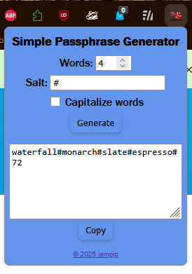

# 🧩 Simple Passphrase Generator (Firefox Extension)

A lightweight, offline-friendly Firefox extension that generates secure and human-readable passphrases with some salt and RNG.  

---

## 🚀 Features

- Generates random passphrases using secure cryptographic randomness (`crypto.getRandomValues`)
- Adjustable number of words and separators
- Optional capitalization toggle
- Random 2-digit number added to the end for extra entropy
- Copy-to-clipboard functionality

---

## 🖼️ Preview


---

## 🧠 How to Install Locally

1. Download or clone this repository and save to a known directory
2. Go to ```about:debugging#/runtime/this-firefox```
3. Click “Load Temporary Add-on…”
4. Select and open the ```manifest.json``` inside the folder. 
5. Simple Passphrase Generator should now appear in your extensions. 
6. Right click to Pin to Taskbar.

## 🍔 How to Download And Install To Firefox

1. Click on this link https://addons.mozilla.org/en-US/firefox/addon/simple-passphrase-generator/
2. On the webpage, click "Add to Firefox"
3. ?????
4. Profit!!!
